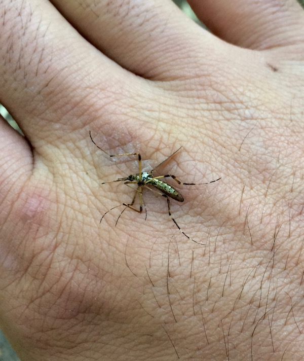
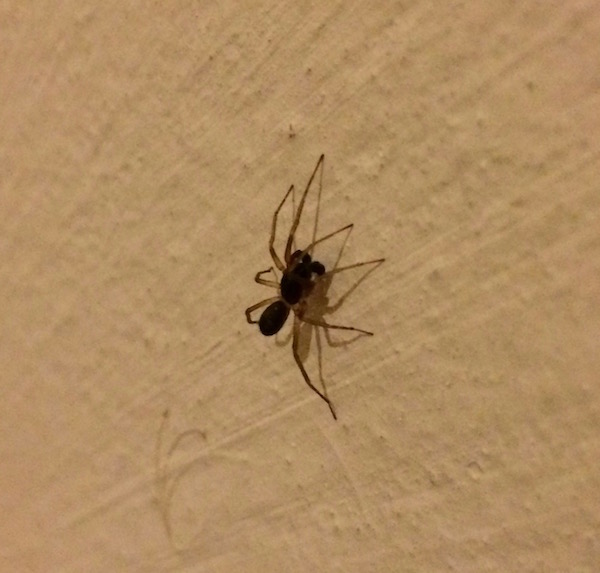

Acá iré dejando fotos de bichos, plantas y cosas que vaya encontrando por ahí.

La mayor parte de las fotos tratan de retratar situaciones normales hoy, que pueden dejar de ocurrir mañana o no suceder en otro lugar.

Además, el planeta es diverso, lo que a mi me parece normal, a otra persona le resultará exótico y viceversa.

Esos y otros motivos me llevan a compartirlos.

En todos los casos puede verse una versión en mayor tamaño de la imagen si se la cliquea.

¡Si alguien conoce el nombre científico de alguno, me encantaría que me lo envíe por email!

# Casa y alrededores

## Avispas construyendo su panal, primer semana de febrero de 2016:

## Polillas que no son grises y feas, segunda quincena de enero de 2016:

## Cosas que parecen mosquitos y son grandes, feos o ambos:

Mosquito enorme, primer semana de diciembre de 2015:

Ni idea del nombre de esto, ni si chupa sangre. Para referencia, cada cuadradito de la grilla tiene 1mm de lado. Última semana de enero de 2016:

Mosquito enorme, aunque de aspecto inocente, última semana de enero de 2016:

## Arañas:

Araña a la que aquí llamamos "araña pollito". Suele encontrarse debajo de cortezas, maderas, chapas, tapas de colmenas, etc. Su aspecto es fiero, nunca me animé a agarrarlas directamente. Segunda semana de diciembre de 2015:

Acá encontré una dentro de mi casa, segunda semana de febrero de 2016:

Araña que siempre anda corriendo por el jardín. Nunca he visto que hicieran telarañas. No es muy grande ni de aspecto amenazador. Las he agarrado con la mano sin problemas, no son agresivas. Última semana de diciembre de 2015:

Esta arañita de 3 o 4mm parecía inocente con su telaraña en un rincón de la casa. Nunca creí que fuera tan eficaz. Tercer semana de enero de 2016:

Menos de dos centímetros en total en su dimensión más amplia. La he visto en el baño, merodeando varios días en los mismos lugares, por la noche. Última semana de enero de 2016:

Una araña que hacía un movimiento rítmico hacia arriba y abajo con el abdomen, caminaba unos centímetros y repetía. Tamaño 1cm aprox. Primer semana de febrero de 2016:

## Grillos, langostas y cosas que se le parecen

Estas langostas son las que plagaron el norte del país en enero de 2016. Aquí un grupo de ellas cerca de mi casa. Primer semana de enero de 2016:

Misma especie de langostas, primer semana de enero de 2016, ahora en estado adulto:

## Varios bichos

A estos insectos los denominamos genéricamente vaquitas. Hay amarillas con lunares negros, negras con lunares de colores, blancas con lunares, verdes con lunares, rojas con lunares. También creo que hay sin lunares. Primer semana de febrero de 2016:

