Dibujos de cosas y lugares que he observado, dibujos copiados, dibujos robados, dibujos arruinados y otros inempeorables. Todo eso por aquí.

Las imágenes se muestran en un tamaño pequeño para que la página cargue más rápido. Haciendo click sobre cada una se ve con más detalle (para mejor o peor).

Las que tienen borde rojo son las últimas que he subido.

* TOC
{:toc}

# Objetos y cosas que veo

## Calzado

[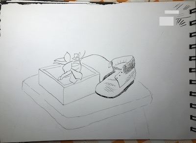]()
 

 

## Mates

 

 

## Naturaleza
[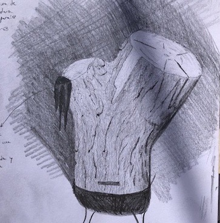](objeto_tronco.jpeg)
[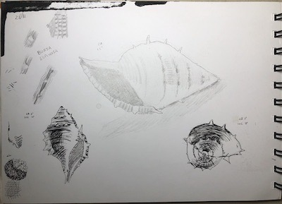](objeto_caracol.jpeg)

{:.new}
{:.new}

{:.new}
{:.new}
{:.new}
[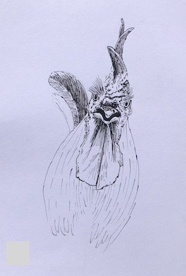](naturaleza_arturo1.jpeg){:.new}
{:.new}
 

 

## Varios

[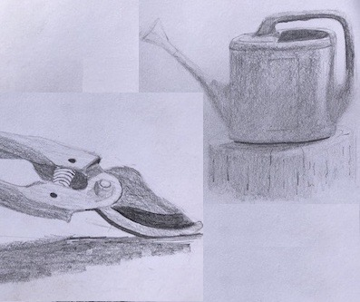](objeto_regadera.jpeg)

[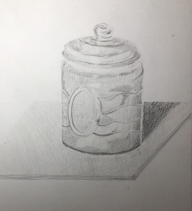](objeto_frasco.jpeg)
[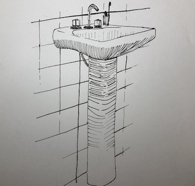]()

{:.new}
[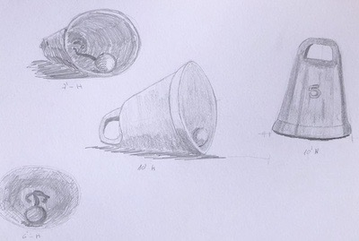](varios_campana.jpeg){:.new}
[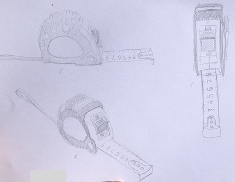](varios_cinta_metrica.jpeg){:.new}
[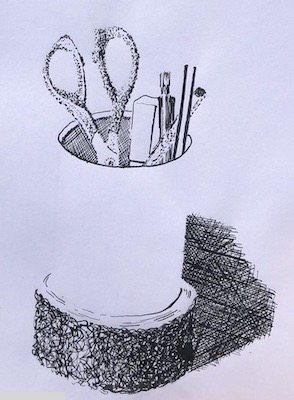](varios_lapicero.jpeg){:.new}
[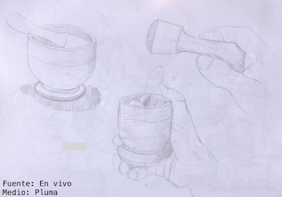](varios_mortero.jpeg){:.new}
{:.new}
 

 

# Cosas que copio de por ahí

## McQue

[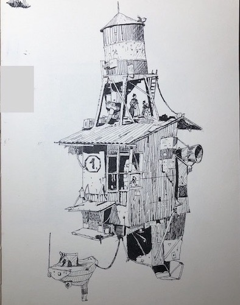](varios_mcque1.jpeg)
 

 

## Banksy
[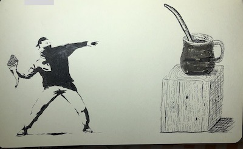](varios_lanzayerba.jpeg)

 

 

## Da Vinci

 

 

## Frasca

 

 

## Otros

{:.new}
{:.new}
[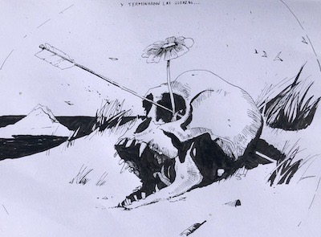](varios_breccia_calavera.jpeg){:.new}
{:.new}
{:.new}
{:.new}
 

 

# Paisajes
[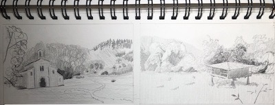](paisaje_varios.jpeg)
[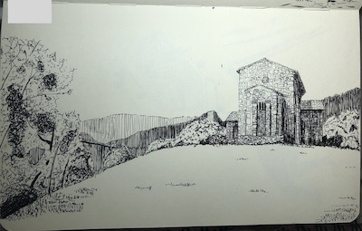](paisaje_templo2.jpeg)

[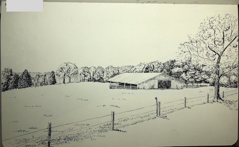](paisaje_galpon.jpeg)

{:.new}
{:.new}
[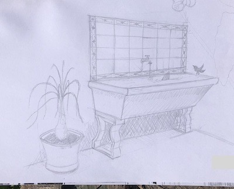](varios_lavadero.jpeg){:.new}
 

 

# Inspirados en algo que me gustó

 

 

## Ejercicios
[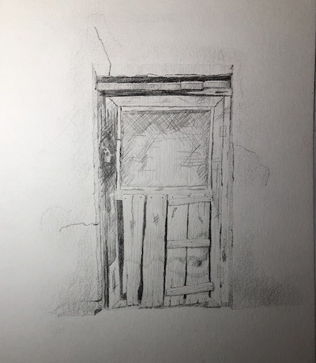](foto_puerta.jpeg)

[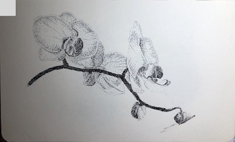](foto_orquideas.jpeg)

[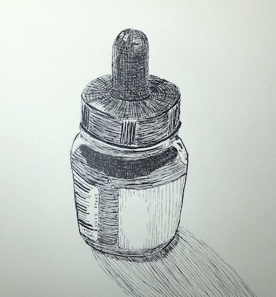](foto_tintero.jpeg)

[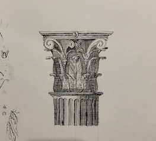](ejercicio_columna.jpeg){:.new}