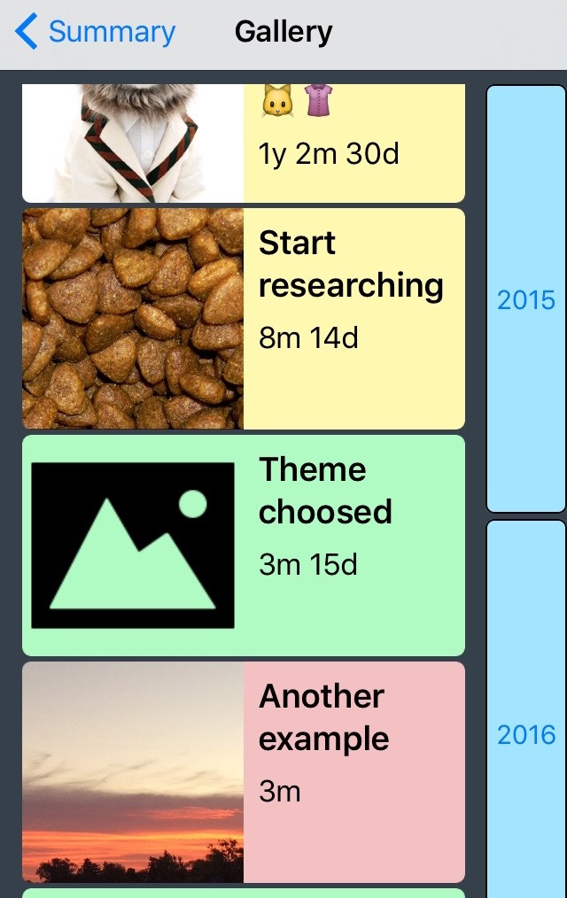
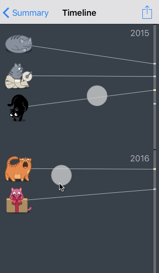

* TOC
{:toc}

## How to use

### Milestone
This represents a single event, like "bought home", "planted a tree", "start writing first page of the book". A milestone have at least a name and a date, and you can provide a picture and notes about it.

This is how a milestone looks in the navigator:

{:.help}

And this is how it looks in detail:

{:.help}

Tip: you can tap the dates to get the time ellapsed up to today.

### Story
A set of related events, it could be a project, for example: "book writing", "car maintenance". It needs to have a name and can have some notes.

This is how a story would look like in the navigator:

{:.help}

You can choose a color and configure the main event for a Story, but that's another story, explained later below.

A story can have substories inside, this brings great posibilities to what you can do with the app!

For example:

    - 🏫 School:
        - Math:
            - Project 1 handed in (Feb 3rd, 2016)
            - Project 2 handed in (Mar 7th, 2016)
            - Exam about trigonometry 😱 (Mar 20th, 2016)
        - Biology:
            - Course project:
                - Theme choosed (Jan 14th, 2016)
                - First stage completed (Feb 2nd, 2016)
            - 🐈 Exam about cats metabolism (Feb 1st, 2016)
    - 🏭 MyCompany:
        - Founded 🎉 (Jan 23th, 2015)
        - Start selling cat clothes 🐱👚 (Jan 30th, 2015)
        - Cat food project
            - Start researching (Aug 15th, 2015)
    - ...

In the example, any item without a date is a story: "🏫 School", "Math", "Biology", "Course project",... Lets go to understand why the stories hasn't dates and what we do about that.

#### Main Event

The stories have not a date because comprises of a set of points in the time. For example, the "Math" story have three points:

    - Project 1 handed in (Feb 3rd, 2016)
    - Project 2 handed in (Mar 7th, 2016)
    - Exam about trigonometry 😱 (Mar 20th, 2016)

So if we would like to put the "Math" story in a timeline, will need three dates!

In Cronito there is a concept "Main Event" that helps you to sort or compare stories. That is just the first or the last event from the story. That event gives the story a date and a picture for the Events Navigator panel in the app.

So, for example, if we choose "First" as the main event for the "Math" story, the "Math" will be sorted using the Feb 3rd as reference date.

#### Color

So, you already loaded some events in the app and want to see a timeline. After all that is the reason this app is installed there, isn't?

When drawing the timeline, each milestone is drawn as a mark in the vertical line that represents the inexorable flow of the time. If all of the marks were the same color, it would not be so helpful at all.

{:.helpSideToSide}
{:.helpSideToSide}

Cronito allows you to choose a color for each story. All of the events inside that story will be drawn of that color.

The stories can have stories inside, but don't be scared, that's not so complicated once you've got it! If a story inside another story have a color, that one will be used for the events inside the substory.

Example:

    - 🏫 School: (YELLOW 💛)
        - Math: (BLUE 💙)
            - Project 1 handed in (will be blue)
            - Project 2 handed in
            - Exam about trigonometry 😱
        - Biology: (GREEN 💚)
            - Course project: (NO COLOR 💔)
                - Theme choosed
                - First stage completed (will be green)
            - 🐈 Exam about cats metabolism
    - 🏭 MyCompany: (YELLOW 💛)
        - Founded 🎉
        - Start selling cat clothes 🐱👚
        - Cat food project (NO COLOR 💔)
            - Start researching
    - ...

There, the "First stage completed" will be green because it's inside a story without a color that is inside a green story.

However, the "Project 1 handed in" milestone will be blue.

In short: the nearest ancestor story with a color is whom gives the milestone a color.

### Timeline

After all, this is what Cronito is about!

A timeline is a straight line divided by certain period (1 day, 1 month, 1 year) and with marks that represents an event happening.

If the event have a picture, it may be shown there.

In the Cronito timeline, you can pinch to zoom it in/out and get a different detail level.

{:.help}

The button at the top-left of the screen generates a PDF file that allows you to share the timeline or to print it.

PRO tip: if you are seeing a yearly timeline, the PDF will have a yearly timeline. If you zoom in the Cronito timeline until get a monthly detail, the PDF will have a monthly timeline. That's because I didn't want to add more buttons in the UI, sorry.

# I have more questions

... and I would like to help you.

If you have more questions, found errors, have suggestions, anything, just send me an email: [send email](mailto:{{author.email}})

# Thanks

You're welcome