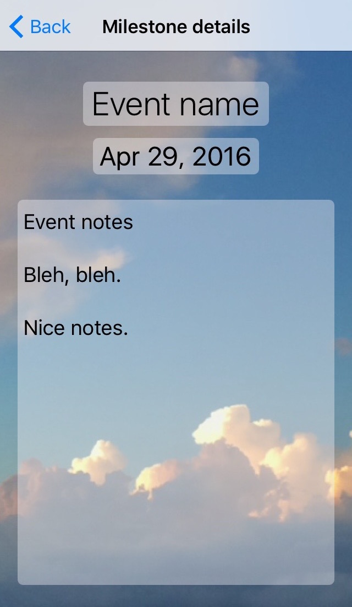
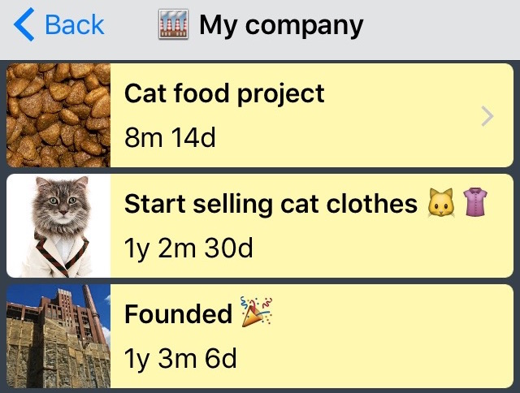
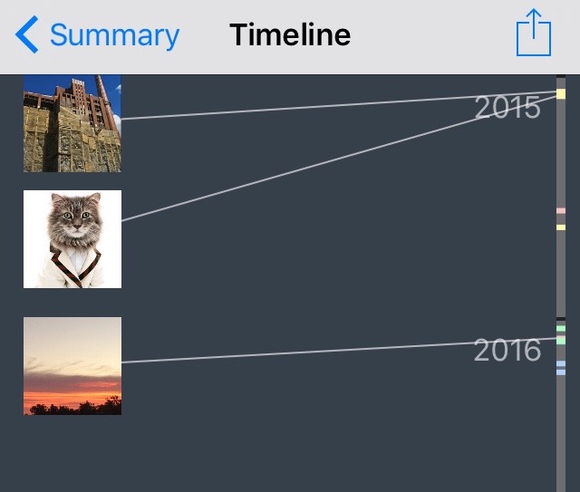
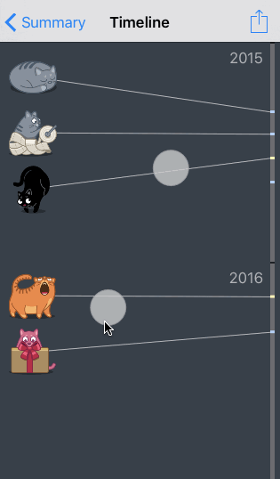

* TOC
{:toc}

## Cómo usarlo

### Hito
Representa un evento particular, como "compra de casa", "planté un árbol", "comencé a escribir la primer página del libro". Tiene al menos un nombre y una fecha, además puedes agregar notas y una foto.

Así es como se vería un hito en el navegador de la aplicación:

{:.help}

Y así es como podrías verlo en detalle, si tocas:

{:.help}

Pista: tocando la fecha, puede verse cuánto tiempo ha pasado hasta hoy.

### Grupo
Es un conjunto de eventos relacionados, podría ser como un proyecto, por ejemplo: "proyecto del libro", "mantenimiento del coche". Sólo necesita un nombre, aunque puedes agregarle notas si lo deseas.

Así es como un grupo puede verse en el navegador:

{:.help}

Puedes elegir un color y configurar el evento principal del grupo, pero ese es otro tema que explicaré más adelante.

Un grupo puede tener subgrupos, ¡esto que brinda muchas posibilidades a lo que puedes haer con Cronito!

Por ejemplo:

    - 🏫 Escuela:
        - Matemáticas:
            - Proyecto 1 entregado (3 de Febrero de 2016)
            - Proyecto 2 entregado (7 de Marzo de 2016)
            - Examen de trigonometría 😱 (20 de Marzo de 2016)
        - Biología:
            - Proyecto de cursada:
                - Elegido el tema (14 de Enero de 2016)
                - Primer etapa completada (2 de Febrero de 2016)
            - 🐈 Examen sobre el metabolismo de los gatos (1 de Febrero de 2016)
    - 🏭 MiEmpresa:
        - Fundada 🎉 (23 de Enero de 2015)
        - Comienza a venderse ropas para gatos 🐱👚 (30 de Enero de 2015)
        - Proyecto de comida para gatos
            - Inicio de investigación (15 de Agosto de 2015)
    - ...

En el ejemplo, los ítems sin fecha son grupos: "🏫 Escuela", "Matemáticas", "Biología", "Proyecto de cursada",... Vayamos al siguiente punto para entender por qué los grupos no tienen fecha y qué podemos hacer al respecto.

#### Evento principal

Los grupos no pueden tener una fecha porque abarcan un conjunto de puntos en el tiempo (hitos). Por ejemplo: el grupo "Matemáticas" tiene tres puntos:

    - Proyecto 1 entregado (3 de Febrero de 2016)
    - Proyecto 2 entregado (7 de Marzo de 2016)
    - Examen de trigonometría 😱 (20 de Marzo de 2016)

Así que, si quisiéramos dibujar el grupo "Matemáticas" en la línea del tiempo, necesitaríamos tres fechas.

En Cronito hay un concepto "Evento Principal" que ayuda a ordenar o comparar grupos en la vista del navegador.

El grupo principal es el primer o último evento del grupo, él le da al grupo una fecha y una imagen.

Así que, si elegimos "Primero" como el evento principal de "Matemáticas", veremos que "Matemáticas" tiene como fecha el 3 de Febrero de 2016.

#### Color

Ya has cargado algunos eventos en la aplicación y quieres ver una línea del tiempo. Después de todo, es la razón por la que has instalado Cronito ¿no?

Cuando se dibuja una línea del tiempo, cada hito es pintado como una marca en la línea vertical que representa el inexorable flujo del tiempo. Si todas las marcas fueran del mismo color, no sería tan útil.

{:.helpSideToSide}
{:.helpSideToSide}

Cronito te permite elegir un color para cada grupo. Todos los eventos dentro del mismo serán pintados de dicho color.

Como hemos mencionado antes, los grupos pueden tener grupos dentro. ¡Pero no te asustes, eso no es tan complicado una vez que lo has entendido!

Si un grupo dentro de otro tiene un color, éste será el color usado por los eventos dentro del subgrupo. ¡Que se me lengua la traba!

Un ejemplo ayudará a explicarlo mejor:

    - 🏫 Escuela: (AMARILLO 💛)
        - Matemáticas: (AZUL 💙)
            - Proyecto 1 entregado (será azul)
            - Proyecto 2 entregado
            - Examen de trigonometría 😱
        - Biología: (VERDE 💚)
            - Proyecto de cursada: (SIN COLOR 💔)
                - Elegido el tema
                - Primer etapa completada (será verde)
            - 🐈 Examen sobre el metabolismo de los gatos
    - 🏭 MiEmpresa: (AMARILLO 💛)
        - Fundada 🎉
        - Comienza a venderse ropas para gatos 🐱👚
        - Proyecto de comida para gatos: (SIN COLOR 💔)
            - Inicio de investigación
    - ...

Aquí, el hito "Primer etapa completada" será verde ya que está dentro de un grupo sin color, que está dentro de un grupo verde.

Sin embargo, el hito "Proyecto 1 entregado" será azul.

Resumiendo: yendo hacia atrás desde un hito, el primer grupo que tenga un color será el que le asigne color.

### Línea del tiempo

¡Despues de todo esto es todo acerca de lo que Cronito se trata!

Una línea del tiempo es una línea recta dividida en períodos (día, mes, año), con marcas que representan la ocurrencia de algún evento.

Si el evento tiene una imagen, podrá verse aquí.

En la línea del tiempo de Cronito, puedes pellizcar para tener distintos niveles de detalle.

{:.help}

El botoncito arriba a la derecha de la pantalla genera un archivo PDF que sirve para que compartas la línea del tiempo con tus amigos o la imprimas.

Pista: si estás viendo una línea del tiempo anual, el PDF será una línea del tiempo anual. Si la aumentas un poco hasta ver los meses, el PDF será una línea del tiempo mensual, más detallada. Eso es porque no quería agregar más botones a la interfaz, disculpas.

# ¡Tengo más preguntas!

... y yo estaré encantado de ayudarte.

Si tienes más preguntas, has encontrado errores, tienes sugerencias, lo que fuera, tan sólo envíame un mensaje: [Enviar mensaje](mailto:{{author.email}})

# Gracias

Por nada.