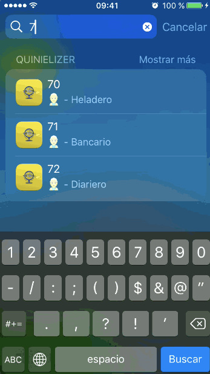



## How to use

Type the number you want to hide and choose an option (dreams, professions). The app will show your encoded number.

You can select and copy the code to paste whenever you want.

It's possible also to use Spotlight for quick searches (up to 2 digits):

{:.help}

## More

If you have questions, found errors, have suggestions, anything, just send me an email: [send email](mailto:{{author.email}})

Thanks for download this app!