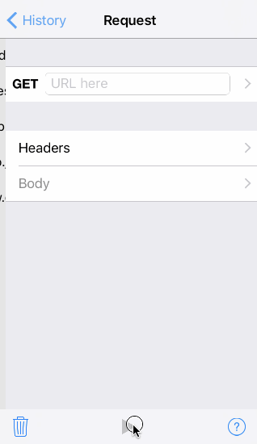



## How to use

Instead of writing long about how to use it, as the app is not so big or complex, I think this small recording will explain itself:

{:.help}

What I did there?

 1. Started looking at the request history, where the requests are stored with their body and header.
 2. Created a new request.
 3. Executed the request.
 4. Went back to the history and selected some item from there.

Note: the history will store only different requests, so if you execute two times the same, will be stored only one.

Note 2: any change on the request body, header or URL make it different, so will be a new item in the history.

## I need some help

If you have questions, found errors, have suggestions, anything, just send me an email: [send email](mailto:{{author.email}})

Thanks for download this app!